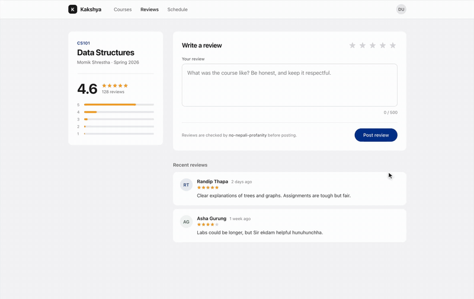
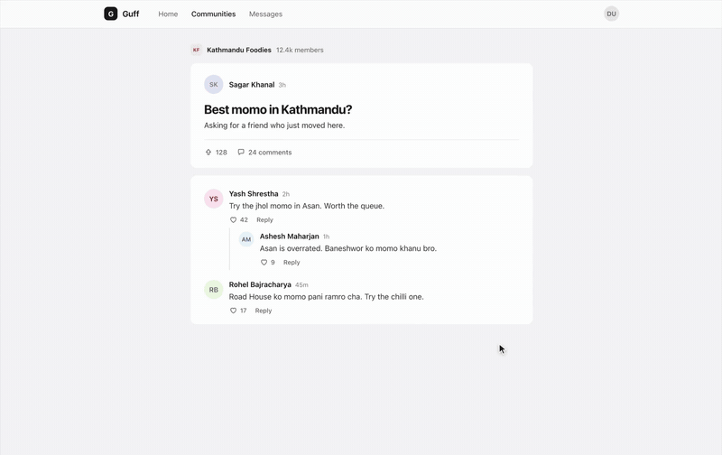

# mukhxadnahunna.com

Documentation site for `no-nepali-profanity`, a profanity filter for English, Romanized Nepali and Devanagari, with
packages for JavaScript, Python, Go, PHP and Dart. Built with [VitePress](https://vitepress.dev).

**Live at [mukhxadnahunna.com](https://mukhxadnahunna.com)**

| Blocks it | Censors it |
|---|---|
|  |  |
| Use it as form validation: reject abusive input before it's submitted. | Or censor on the client: mask the abuse and let the post through. |

## Structure

```
docs/
  index.md                 landing page for all ports
  js/ python/ go/ php/ flutter/
                           one folder per port, each with the same twelve pages
  _shared/                 sections every port includes: how matching works, limitations, the lexicon's levels,
                           contributing rules and the introduction's features
  public/CNAME             custom domain for GitHub Pages
  .vitepress/config.mts    nav and sidebar
  .vitepress/theme/languages.ts
                           the ports and the list of doc pages
```

The ports are listed once, in `docs/.vitepress/theme/languages.ts`. The landing page (language tabs, rolling
install command, buttons, ports section), the language switcher in the sidebar, the sidebar itself and the top nav
all read from it.

Every port has the same pages (`DOC_PAGES` in `languages.ts`), so the switcher keeps readers on the same page when
they change language. Text that doesn't depend on the language lives once in `docs/_shared/` and is pulled into each
port's page with `<!--@include: ../_shared/…-->`. Code examples are written per port, in that port's syntax.

To add a port:

1. Add it to `PORTS` in `languages.ts`, with `released: false`. Until it's released, it gets a one-page "coming soon"
   sidebar, so write that page at `docs/<port>/index.md`.
2. Write its docs under `docs/<port>/`, with one page for each entry in `DOC_PAGES`.
3. Set `released: true`.

When a package is published to its registry, remove the "Pre-release" warning from its `installation.md`.

## Hero video

The landing page hero plays two recordings of the demo apps in `../demo`, one after the other: a course review
being blocked, then a reply being censored. Tabs under the video show which is playing and switch between them.

To replace them:

1. Record the demos (see `demo/README.md`).
2. Save the recordings in this folder as `comment-blocked.mov` and `comment-censored.mov`. Raw `.mov` files here are
   git-ignored.
3. Run `./scripts/encode-hero-videos.sh`. It writes an MP4, a WebM and a poster image for each into
   `docs/.vitepress/theme/media/`, holding the last frame for 1.5 seconds so the result can be read. The landing
   page imports them from there, so each build gives them content-hashed file names and a new recording always
   gets a new URL.
4. Regenerate the GIFs at the top of this README from the new MP4s:
   ```sh
   for n in comment-blocked comment-censored; do
     ffmpeg -y -i docs/.vitepress/theme/media/$n.mp4 -vf "fps=12,scale=800:-1:flags=lanczos,split[a][b];[a]palettegen=max_colors=128:stats_mode=diff[p];[b][p]paletteuse=dither=bayer:bayer_scale=4:diff_mode=rectangle" -loop 0 .github/media/$n.gif
   done
   ```

The labels and captions are in `HERO_VIDEOS` at the top of `docs/.vitepress/theme/components/Landing.vue`. Visitors
who have reduced motion turned on get paused videos with controls instead of autoplay.

## Local development

```sh
npm install
npm run docs:dev       # dev server with hot reload
npm run docs:build     # production build in docs/.vitepress/dist
npm run docs:preview   # serve the production build
```
